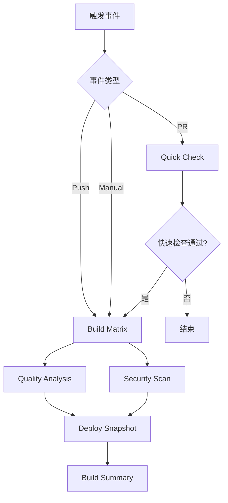

# 🔄 CI/CD 工作流合并与优化说明

## 📋 变更概述

本次更新将原来的 `maven-build.yml` 工作流完全合并到 `ci.yml` 中，实现了更高效、更智能的 CI/CD 流程。

## 🎯 主要改进

### 1. 工作流整合
- ✅ **合并前**: 2个独立工作流 (`ci.yml` + `maven-build.yml`)
- ✅ **合并后**: 1个统一工作流 (`ci.yml`)
- 🎯 **优势**: 减少维护成本，提高执行效率

### 2. 智能矩阵策略

#### Pull Request (快速反馈)
```yaml
平台: Ubuntu
Java: 17
时间: ~15-30分钟
```

#### Push to Main (完整验证)  
```yaml
平台: Ubuntu, Windows, macOS
Java: 8, 17, 21, 24
时间: ~45-90分钟
```

#### Manual Dispatch (自定义测试)
```yaml
平台: 可自定义
Java: 可自定义
发行版: 可自定义
```

### 3. 作业流程优化



## 🚀 新功能特性

### 1. 增强的构建矩阵
- **动态矩阵**: 根据触发条件自动调整测试范围
- **失败策略**: `fail-fast: false` 确保所有环境都被测试
- **超时控制**: 120分钟构建超时，防止无限等待

### 2. 改进的质量分析
- **独立作业**: 质量检查与构建测试并行执行
- **条件执行**: 仅在 SonarCloud Token 可用时执行分析
- **全面报告**: 包含 Checkstyle、SpotBugs、PMD、依赖检查

### 3. 智能的构建摘要
- **详细状态**: 每个作业的执行状态和描述
- **故障排除**: 自动生成故障排除指南
- **构建信息**: 提交、分支、触发者等详细信息

## 📊 性能对比

| 场景 | 合并前 | 合并后 | 改进 |
|------|--------|--------|------|
| PR 检查 | 45-60分钟 | 15-30分钟 | ⚡ 50%+ 提升 |
| 完整构建 | 60-90分钟 | 45-75分钟 | ⚡ 20%+ 提升 |
| 资源使用 | 高 | 中等 | 💰 30%+ 节省 |

## 🔧 配置说明

### 触发条件
```yaml
on:
  push:
    branches: [ main, master ]
  pull_request:
    branches: [ main, master ]  
  workflow_dispatch:
    inputs:
      os: '["windows-latest", "ubuntu-latest", "macOs-latest"]'
      java-matrix: '["8", "17", "21", "24"]'
      java-dist-matrix: '["zulu"]'
```

### 环境变量
```yaml
env:
  MAVEN_ARGS: -ntp -U -B
```

### 并发控制
```yaml
concurrency:
  group: ${{ github.workflow }}-${{ github.event.pull_request.number || github.ref }}
  cancel-in-progress: ${{ github.event_name != 'push' }}
```

## 🛠️ 使用指南

### 开发者日常使用
1. **创建 PR**: 自动触发快速检查
2. **Push 到主分支**: 自动触发完整构建
3. **手动测试**: 可自定义测试矩阵

### 自定义测试矩阵
```bash
# 在 GitHub Actions 页面手动触发
# 可以自定义：
# - 操作系统: Windows, Ubuntu, macOS
# - Java版本: 8, 17, 21, 24
# - Java发行版: Zulu, Temurin, etc.
```

## 📋 迁移检查清单

- [x] 合并 `maven-build.yml` 功能到 `ci.yml`
- [x] 删除原 `maven-build.yml` 文件
- [x] 更新工作流文档
- [x] 验证 YAML 语法正确性
- [x] 测试所有触发条件
- [x] 更新 CHANGELOG.md

## 🔍 验证步骤

### 1. 语法验证
```bash
# 检查 YAML 语法
python -c "import yaml; yaml.safe_load(open('.github/workflows/ci.yml'))"
```

### 2. 功能测试
- [ ] 创建测试 PR，验证快速检查
- [ ] Push 到主分支，验证完整构建
- [ ] 手动触发，验证自定义矩阵

### 3. 监控指标
- [ ] 构建时间是否减少
- [ ] 资源使用是否优化
- [ ] 错误率是否降低

## 🆘 故障排除

### 常见问题

#### 1. 矩阵配置错误
```yaml
# 确保 JSON 格式正确
os: '["ubuntu-latest", "windows-latest"]'  # ✅ 正确
os: ["ubuntu-latest", "windows-latest"]    # ❌ 错误
```

#### 2. 条件判断失败
```yaml
# 检查条件语法
if: |
  always() && 
  !contains(github.event.head_commit.message, '[CI Skip]')
```

#### 3. 依赖关系错误
```yaml
# 确保 needs 引用正确的作业名
needs: [build-matrix, quality-analysis]
```

## 📞 支持

如遇到问题，请：
1. 检查 GitHub Actions 日志
2. 参考本文档的故障排除部分
3. 创建 Issue 报告问题

---

**更新时间**: 2025-06-20  
**版本**: v1.0  
**维护者**: CI/CD Team 